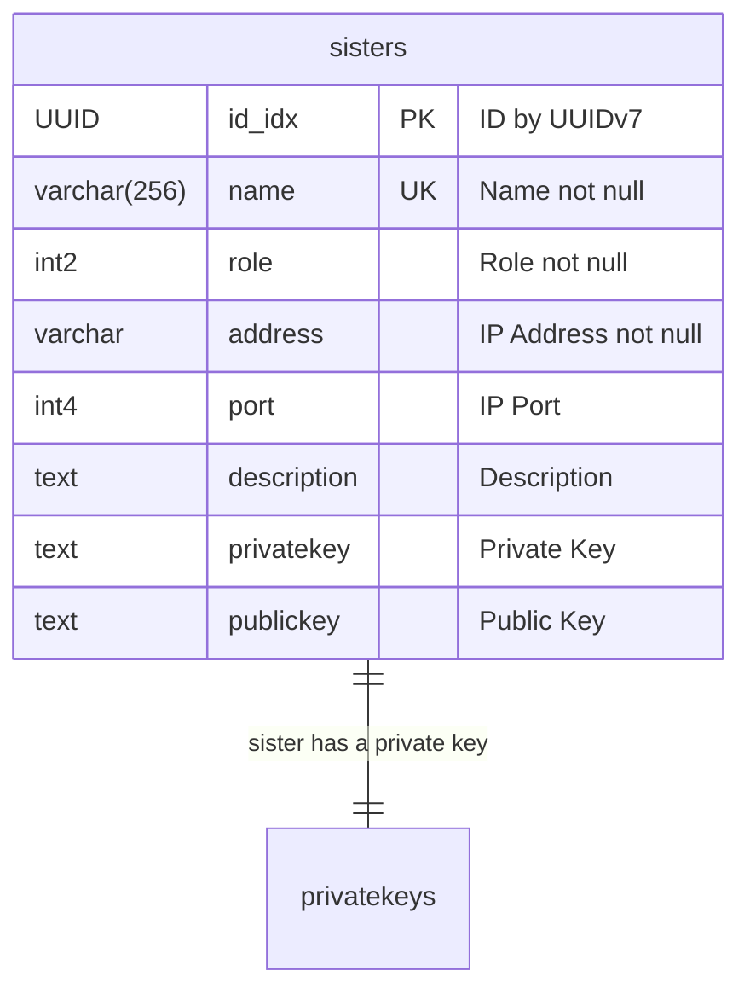

```mermaid 
erDiagram
    sisters ||--|| privatekeys : "sister has a private key" 
    sisters{
        UUID id_idx PK  "ID by UUIDv7"
        varchar(256) name UK "Name not null"
        int2 role "Role not null"
        varchar address "IP Address not null"
        int4 port "IP Port"
        text description "Description"
        text privatekey "Private Key"
        text publickey "Public Key"
    }


```
