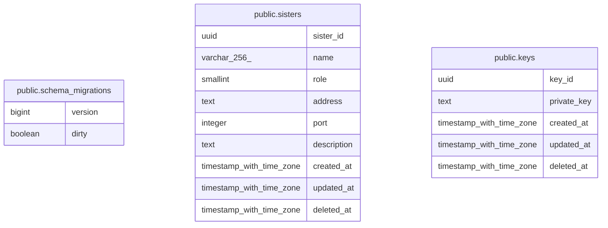

# last-order

## Description

last-order's database

## Tables

| Name                                                    | Columns | Comment                  | Type       |
| ------------------------------------------------------- | ------- | ------------------------ | ---------- |
| [public.schema_migrations](public.schema_migrations.md) | 2       | migration data.          | BASE TABLE |
| [public.sisters](public.sisters.md)                     | 9       | sisters data table.      | BASE TABLE |
| [public.keys](public.keys.md)                           | 5       | private keys data table. | BASE TABLE |

## Relations

---

> Generated by [tbls](https://github.com/k1LoW/tbls)
