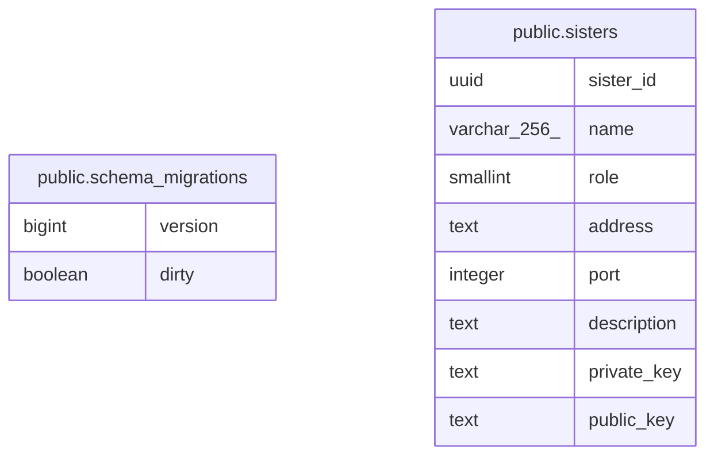

# last-order

## Description

last-order's database

## Tables

| Name                                                    | Columns | Comment              | Type       |
| ------------------------------------------------------- | ------- | -------------------- | ---------- |
| [public.schema_migrations](public.schema_migrations.md) | 2       | migration data.      | BASE TABLE |
| [public.sisters](public.sisters.md)                     | 8       | jsisters data table. | BASE TABLE |

## Relations

---

> Generated by [tbls](https://github.com/k1LoW/tbls)
