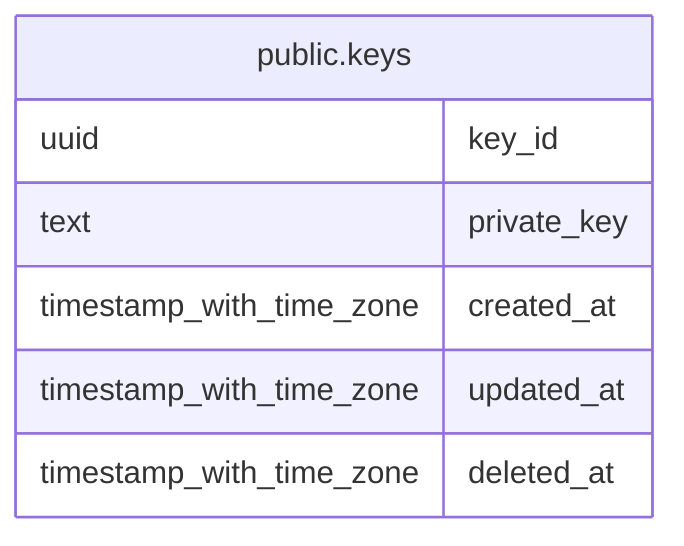

# public.keys

## Description

private keys data table.

## Columns

| Name        | Type                     | Default | Nullable | Children | Parents | Comment                  |
| ----------- | ------------------------ | ------- | -------- | -------- | ------- | ------------------------ |
| key_id      | uuid                     |         | false    |          |         | private key id(UUID v7). |
| private_key | text                     |         | true     |          |         | ssh private key.         |
| created_at  | timestamp with time zone |         | true     |          |         | timestamp.               |
| updated_at  | timestamp with time zone |         | true     |          |         | timestamp.               |
| deleted_at  | timestamp with time zone |         | true     |          |         | timestamp.               |

## Constraints

| Name      | Type        | Definition           |
| --------- | ----------- | -------------------- |
| keys_pkey | PRIMARY KEY | PRIMARY KEY (key_id) |

## Indexes

| Name      | Definition                                                        |
| --------- | ----------------------------------------------------------------- |
| keys_pkey | CREATE UNIQUE INDEX keys_pkey ON public.keys USING btree (key_id) |

## Relations

---

> Generated by [tbls](https://github.com/k1LoW/tbls)
