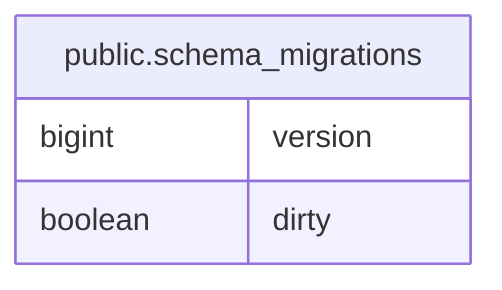

# public.schema_migrations

## Description

migration data.

## Columns

| Name    | Type    | Default | Nullable | Children | Parents | Comment                   |
| ------- | ------- | ------- | -------- | -------- | ------- | ------------------------- |
| version | bigint  |         | false    |          |         | migration schema version. |
| dirty   | boolean |         | false    |          |         | migration status.         |

## Constraints

| Name                   | Type        | Definition            |
| ---------------------- | ----------- | --------------------- |
| schema_migrations_pkey | PRIMARY KEY | PRIMARY KEY (version) |

## Indexes

| Name                   | Definition                                                                                   |
| ---------------------- | -------------------------------------------------------------------------------------------- |
| schema_migrations_pkey | CREATE UNIQUE INDEX schema_migrations_pkey ON public.schema_migrations USING btree (version) |

## Relations

---

> Generated by [tbls](https://github.com/k1LoW/tbls)
