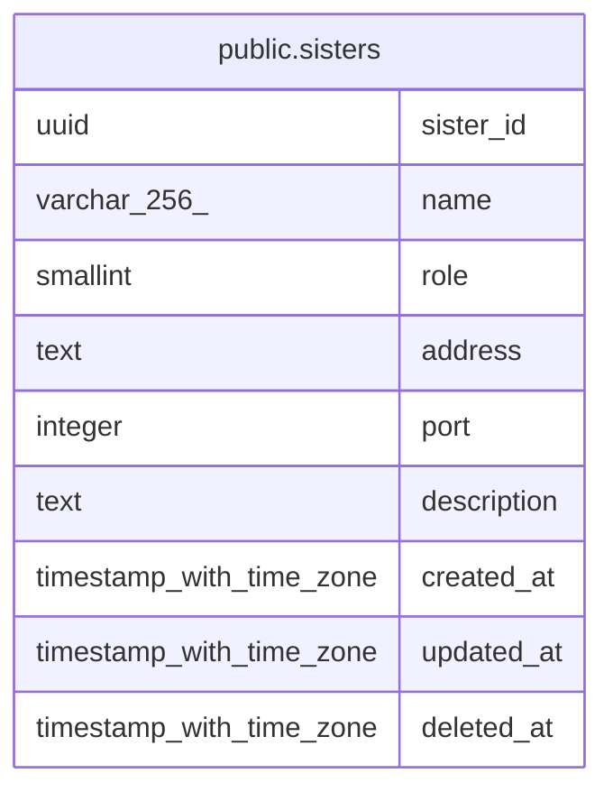

# public.sisters

## Description

sisters data table.

## Columns

| Name        | Type                     | Default | Nullable | Children | Parents | Comment              |
| ----------- | ------------------------ | ------- | -------- | -------- | ------- | -------------------- |
| sister_id   | uuid                     |         | false    |          |         | sister id (UUID v7). |
| name        | varchar(256)             |         | false    |          |         | machine name.        |
| role        | smallint                 |         | false    |          |         | int16_t role field.  |
| address     | text                     |         | false    |          |         | ip address.          |
| port        | integer                  |         | false    |          |         | ip port.             |
| description | text                     |         | true     |          |         | description.         |
| created_at  | timestamp with time zone |         | true     |          |         | timestamp.           |
| updated_at  | timestamp with time zone |         | true     |          |         | timestamp.           |
| deleted_at  | timestamp with time zone |         | true     |          |         | timestamp.           |

## Constraints

| Name             | Type        | Definition              |
| ---------------- | ----------- | ----------------------- |
| sisters_pkey     | PRIMARY KEY | PRIMARY KEY (sister_id) |
| sisters_name_key | UNIQUE      | UNIQUE (name)           |

## Indexes

| Name             | Definition                                                                 |
| ---------------- | -------------------------------------------------------------------------- |
| sisters_pkey     | CREATE UNIQUE INDEX sisters_pkey ON public.sisters USING btree (sister_id) |
| sisters_name_key | CREATE UNIQUE INDEX sisters_name_key ON public.sisters USING btree (name)  |

## Relations

---

> Generated by [tbls](https://github.com/k1LoW/tbls)
